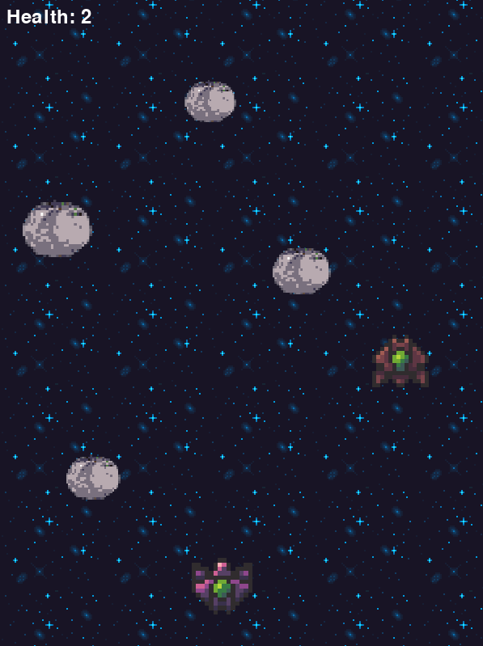

# Invade Spacers

**Invade Spacers** is a simple 2D game that gets you to explore Space! But watch out, the Space race tends to get fast and dangerous, with all the obstacles there is up there...

## Main features
- **Dodge the obstacles**: Move your spaceship left or right to avoid obstacles that try to get on your way
- **Infinite game**: A seamless infinitely scrolling map that challenges you to beat your own record 
- **Increasing speed**: Your speed keeps on going higher and higher




---
## Structure
This is a school project that aims to work using the ECS design pattern.  <br>
There are three main elements composing this code :
- Entities: the different "things" in the world of the game, represented by an id, for example the **user's spaceship**, **obstacles** 
- Components: they are assigned to each entity to hold the data associated to it, like **Position**, **Velocity**
- Systems: they are in charge of updating the data, like **MovementSystem** or **RenderingSystem**
## Game Components and Systems
Quick explanation of the main components and systems used in this project
- **Position**: Defines the position of an entity on the screen
- **Velocity**: Controls the movement speed and direction of an entity
- **Sprite**: Stores the image and size of an entity
- **Flicker**: Stores the duration of the wanted flicker effect
- **Health**: Tracks the health of an entity, such as the player’s ship
- **Background**: Dataless tag here to differenciate the background items from the active elements

---


- **MovementSystem**: Updates entity positions based on their velocity
- **ScrollingSystem**: Handles the vertical scrolling of the background that creates the illusion of an infinite movement
- **ObsSpawnSystem**: Generates obstacles with different random parameters
- **CollisionSystem**: Detects and handles collisions between the player’s ship and obstacles
- **RenderingSystem**: Handle the rendering of all visible entities
- **FlickeringSystem**: Handles the duration of the flickering effect on sprites


## Requirements
- Python 3.10 or higher
- Pygame 2.0 or higher

## Play to the game
If you want to try the game quickly, **download** the appropriate executable file depending on your OS and directly **run** it

| OS | Executable file |
|----|-----------|
| Windows | [main.exe](/dist/main.exe) |
| Linux | Available soon... |
| Mac | Available soon... |

## Setup

Clone the project

```bash
  git clone https://github.com/aleperdriel/ecs-game.git
```

Go to the project directory

```bash
  cd ecs-game
```

If you don't have them : install dependencies

```bash
  pip install pygame
```

Start the game

```bash
  python main.py
```
## Acknowledgments

The basis of this code is mainly inspired by *[Yliess Hati](https://github.com/yliess86)*'s. <br>
### Graphic assets
Thanks to *Lowich* for their [bad-ass spaceships assets](https://lowich.itch.io/free-spaceship-sprites) and to *Piiixl* for their [wonderful space backgrounds](https://piiixl.itch.io/space). <br>

### Sounds
Thanks to :
- *Fupi* for the background music of the game, [Space Bass](https://opengameart.org/content/space-bass)
- *yd* for the background music of the start menu, [Observing the stars](https://opengameart.org/content/another-space-background-track)
- *[NenadSimic](https://opengameart.org/content/muffled-distant-explosion)* and [GreyFrogGames](https://opengameart.org/content/player-hit-damage) for the great sound effects
